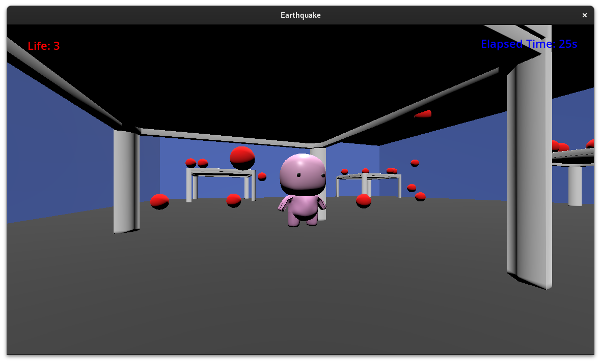

# Survive from the Earthquake

This is a test game made with [Godot](https://godotengine.org/).  It is inspired from [2024 Hualien earthquake](https://en.wikipedia.org/wiki/2024_Hualien_earthquake).

Earthquake is common in Taiwan.  So, people are taught how to reduce the damage and avoid being hurt when earthquake comes.  One of the points is finding a place to hide and protecting head.  Hiding under a strong table is an example.

## Rule

1. The yellow box is the player.
2. The player's life will be decreased if the player is hit by a falling thing.
3. The tables can resist the falling things.
4. When the player's life is decreased to zero, it is game over!
5. The player has 3 lives at beginning.  And, has to survive 60 seconds.

## Controls

* Move: Arrow keys
* Rotate the view: WASD

## Reference

* Table 3D model: https://free3d.com/3d-model/table-747735.html
